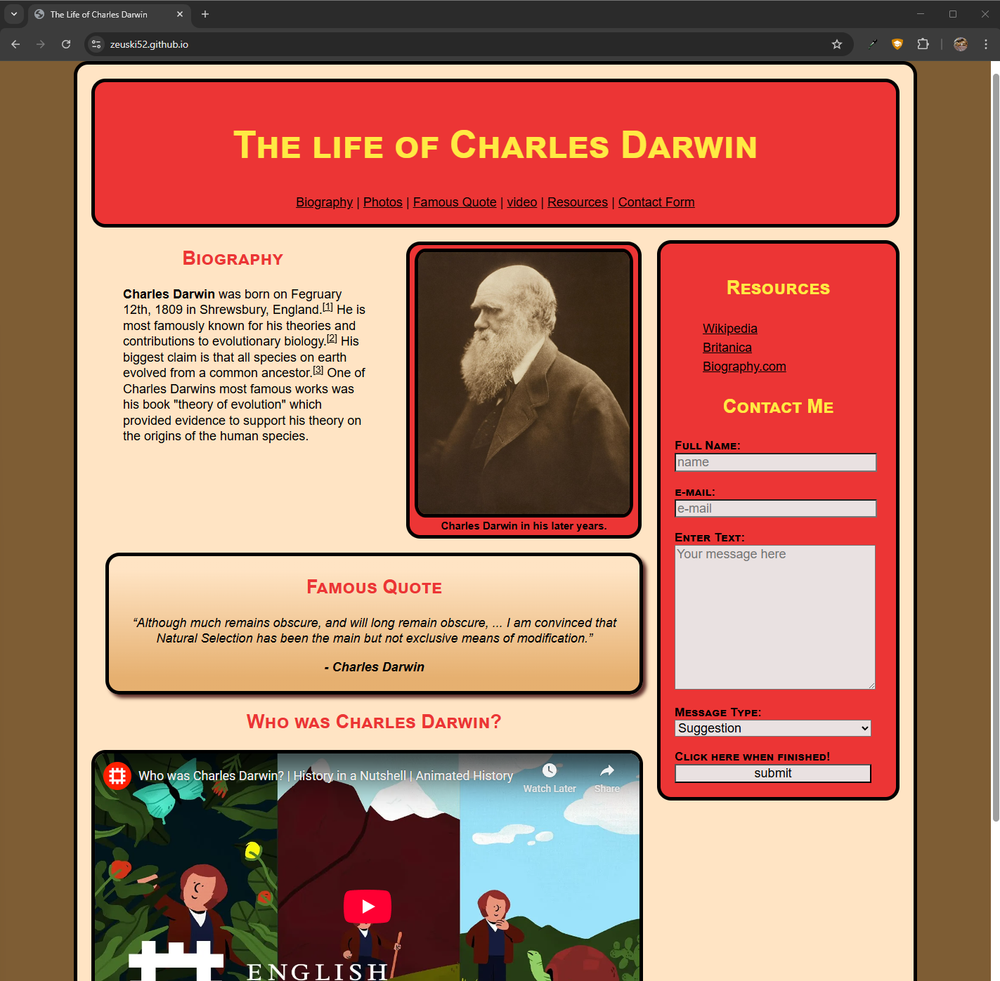

# Static Site – The Life of Charles Darwin

A simple responsive HTML/CSS site about the life of Charles Darwin.  
Created as part of a web development class project.

## Features
- **Semantic HTML5 structure**: header, main, aside, footer  
- **SEO metadata**: description and keywords  
- **Biography section** with blockquote and references  
- **Figure with caption** displaying Darwin’s portrait  
- **Embedded YouTube video** explaining Darwin’s contributions  
- **Famous quote** styled with `<q>` and `<cite>`  
- **Aside panel** with external resources and a styled contact form (name, email, textarea, dropdown, submit)  
- **Custom CSS styling**: responsive layout, brown/bisque theme, small-caps headers, styled links, gradient backgrounds, figure framing  
- **Responsive design**: media query for screens below 1080px  
- **Normalize.css** included for consistent cross-browser rendering  

## How to View
Open `index.html` in any modern browser.  
**or**  
Visit the live site here: [zeuski52.github.io](https://zeuski52.github.io)

If using GitHub Pages:
1. Push this repo to GitHub.  
2. Go to **Settings → Pages → Branch: main → /root**.  
3. Your site will be live at `https://<username>.github.io/static-sites-darwin`.  

## Project Structure
```
├─ index.html
├─ css/
│  ├─ normalize.css
│  └─ styles.css
├─ images/
│  └─ Charles_Darwin.jpg
```
## Example Screenshot


## What I Learned
- Structuring semantic HTML5 pages with main/aside/footer layout  
- Linking external CSS stylesheets and normalize.css  
- Embedding images, quotes, videos, and resource links  
- Building and styling accessible forms  
- Applying responsive CSS (flex/float, media queries)  
